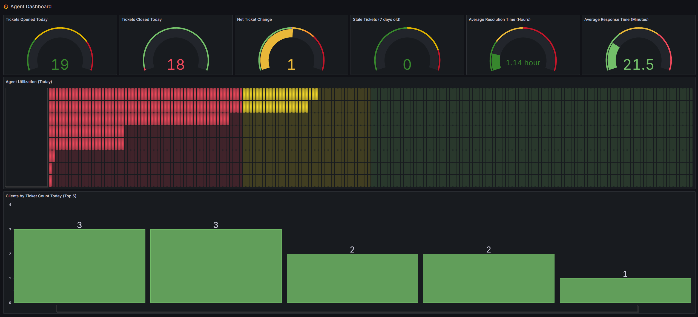

# Agent Dashboard

This Grafana dashboard provides comprehensive monitoring and analytics for agent performance, ticket management, and client metrics. The dashboard includes real-time visualizations for ticket volumes, resolution times, agent utilization, and client activity.

## Dashboard Components

### Panels Included
1. **Tickets Opened Today** - Gauge showing daily ticket volume
2. **Tickets Closed Today** - Gauge tracking closure rates
3. **Net Ticket Change** - Displays the difference between opened and closed tickets
4. **Stale Tickets** - Monitors tickets older than 7 days
5. **Average Resolution Time** - Shows resolution time in hours
6. **Agent Utilization** - Horizontal bar gauge showing daily utilization percentages
7. **Clients by Ticket Count** - Bar chart of top 5 clients by ticket volume

## Setup Instructions

### Prerequisites
- Grafana instance with Infinity Data Source plugin already installed and configured
- API access to your HaloPSA instance

### Creating the Dashboard Manually

1. **Create New Dashboard**:
   - Navigate to **+ > Dashboard**
   - Click **Add visualization**
   - Select your Infinity data source

### Panel 1: Tickets Opened Today (Gauge)

1. **Basic Configuration**:
   - **Panel Title**: "Tickets Opened Today"
   - **Visualization**: Gauge
   - **Position**: Top row, first position (h: 6, w: 4, x: 0, y: 0)

2. **Query Configuration**:
   - **URL**: `https://your-company.halopsa.com/api/Tickets`
   - **Method**: GET
   - **Format**: Table
   - **Parser**: Backend
   - **Root Selector**: `$.record_count`
   - **Query Parameters**:
     - `datesearch`: `datereported`
     - `startdate`: `${__from:date:YYYY-MM-DD} 00:00:00`
     - `enddate`: `${__to:date:YYYY-MM-DD} 23:59:59`
     - `count`: `includeclosed=false`
     - `tickettype_id`: `1,3`

3. **Field Options**:
   - **Max**: 60
   - **Thresholds**:
     - Green: 0
     - Dark Green: 0
     - Dark Yellow: 30
     - Dark Red: 50

### Panel 2: Tickets Closed Today (Gauge)

1. **Basic Configuration**:
   - **Panel Title**: "Tickets Closed Today"
   - **Visualization**: Gauge
   - **Position**: Top row, second position (h: 6, w: 4, x: 4, y: 0)

2. **Query Configuration** (Query A - Closed):
   - **URL**: `https://your-company.halopsa.com/api/Tickets`
   - **Method**: GET
   - **Root Selector**: `$.record_count`
   - **Query Parameters**:
     - `datesearch`: `dateclosed`
     - `startdate`: `${__from:date:YYYY-MM-DD} 00:00:00`
     - `enddate`: `${__to:date:YYYY-MM-DD} 23:59:59`
     - `tickettype_id`: `1,3`
     - `includedclosed`: `true`

3. **Add Second Query** (Query B - Open):
   - Same URL and basic parameters as Query A
   - **Query Parameters**:
     - `datesearch`: `datereported`
     - `includeclosed`: `false`
     - (other parameters same as Query A)

4. **Field Options**:
   - **Max**: 60
   - **Thresholds**: Red: 0

### Panel 3: Net Ticket Change (Gauge)

1. **Basic Configuration**:
   - **Panel Title**: "Net Ticket Change"
   - **Visualization**: Gauge
   - **Position**: Top row, third position (h: 6, w: 4, x: 8, y: 0)

2. **Query Configuration** (Query A - Open):
   - **URL**: `https://your-company.halopsa.com/api/Tickets`
   - **Root Selector**: `$ ~> | $ | {"join_key": "data", "count_a": $.record_count} |`
   - **Query Parameters**:
     - `datesearch`: `dateoccurred`
     - `startdate`: `${__from:date:YYYY-MM-DD} 00:00:00`
     - `enddate`: `${__to:date:YYYY-MM-DD} 23:59:59`
     - `requesttype_id`: `1,3`
     - `includeclosed`: `false`
     - `count`: `1000`

3. **Add Second Query** (Query B - Closed):
   - Same URL and basic setup
   - **Root Selector**: `$ ~> | $ | {"join_key": "data", "count_b": $.record_count} |`
   - **Query Parameters**:
     - `datesearch`: `dateclosed`
     - `includeclosed`: `true`
     - (other parameters same as Query A)

4. **Transformations**:
   - **Join by field**: `join_key`, mode: `outerTabular`
   - **Calculate field**: `count_a Open - count_b Closed`, mode: binary, replace fields: true

5. **Field Options**:
   - **Min**: -50, **Max**: 50
   - **Thresholds**: Green: 0, Green: -0.5, Purple: 0, Yellow: 0.5, Orange: 10, Dark Red: 20

### Panel 4: Stale Tickets (7 days old) (Gauge)

1. **Basic Configuration**:
   - **Panel Title**: "Stale Tickets (7 days old)"
   - **Visualization**: Gauge
   - **Position**: Top row, fourth position (h: 6, w: 4, x: 12, y: 0)

2. **Query Configuration**:
   - **URL**: `https://your-company.halopsa.com/api/Tickets`
   - **Root Selector**: `$count(tickets[tickettype_id = 1 or tickettype_id = 3])`
   - **Query Parameters**:
     - `includeclosed`: `0`
     - `datesearch`: `datemodified`
     - `count`: `1000`
     - `startdate`: `1900-01-01 00:00:00`
     - `enddate`: `${__from:date:YYYY-MM-DD:subtract(7d)} 23:59:59`

3. **Field Options**:
   - **Max**: 60
   - **Thresholds**: Green: 0, Dark Green: 0, Dark Yellow: 30, Dark Red: 50

### Panel 5: Average Resolution Time (Hours) (Gauge)

1. **Basic Configuration**:
   - **Panel Title**: "Average Resolution Time (Hours)"
   - **Visualization**: Gauge
   - **Position**: Top row, fifth position (h: 6, w: 4, x: 16, y: 0)

2. **Query Configuration**:
   - **URL**: `https://your-company.halopsa.com/api/Tickets`
   - **Root Selector**: `$exists($.tickets) and $count($.tickets) > 0 ? $average($.tickets[dateclosed != null].(($toMillis(dateclosed) - $toMillis(dateoccurred)) / (1000 * 60 * 60))) : 0`
   - **Query Parameters**:
     - `closed_only`: `true`
     - `startdate`: `${__from:date:MM-DD-YYYY} 08:00:00`
     - `requesttype`: `1,3`
     - `enddate`: `${__to:date:MM-DD-YYYY} 17:00:00`

     * NOTE: Update the times here for your hours of operation

3. **Field Options**:
   - **Min**: 0, **Max**: 8
   - **Unit**: hours (h)
   - **Decimals**: 2
   - **Thresholds**: Green: 0, Dark Green: 0, Yellow: 2, Dark Red: 4

### Panel 6: Average Response Time (Minutes) (Gauge)

1. **Basic Configuration**:
   - **Panel Title**: "Average Response Time (Minutes)"
   - **Visualization**: Gauge
   - **Position**: Top row, sixth position (h: 6, w: 4, x: 20, y: 0)

2. **Query Configuration** (Query A - Tickets):
   - **URL**: `https://your-company.halopsa.com/api/Tickets`
   - **Root Selector**: `tickets`
   - **Columns**:
     - `id` → `ticket_id` (number)
     - `dateoccurred` → `opened_time` (timestamp)
   - **Query Parameters**:
     - `datesearch`: `dateoccurred`
     - `startdate`: `${__from:date:YYYY-MM-DD} 08:00:00`
     - `enddate`: `${__from:date:YYYY-MM-DD} 17:00:00`
     - `count`: `1000`
     - `tickettype_id`: `1,3`

     * NOTE: Update the times here for your hours of operation

3. **Add Second Query** (Query B - Actions):
   - **URL**: `https://your-company.halopsa.com/api/Actions`
   - **Root Selector**: `actions`
   - **Columns**:
     - `ticket_id` → `ticket_id` (number)
     - `datetime` → `action_time` (timestamp)
     - `outcome` → `outcome` (string)
     - `who_agentid` → `agent_id` (number)
   - **Query Parameters**:
     - `startdate`: `${__from:date:YYYY-MM-DD} 00:00:00`
     - `enddate`: `${__from:date:YYYY-MM-DD} 23:59:59`
     - `agentonly`: `true`
     - `count`: `1000`

4. **Transformations** (in order):
   - **Join by field**: `ticket_id`, mode: `outer`
   - **Filter by value**: Include `opened_time A` is not null
   - **Filter by value**: Include `action_time B` is not null
   - **Sort by**: `action_time B`
   - **Group by**: Group by `ticket_id`, aggregate `action_time B` and `opened_time A` with `firstNotNull`
   - **Calculate field**: `response_time_ms` = `action_time B (firstNotNull)` - `opened_time A (firstNotNull)`
   - **Calculate field**: `response_time_minutes` = `response_time_ms` / `60000`
   - **Filter by value**: Include `response_time_minutes` > 0
   - **Organize**: Exclude unnecessary fields, keep only `response_time_minutes`
   - **Reduce**: Mean

5. **Field Options**:
   - **Min**: 0, **Max**: 90
   - **Thresholds**: Green: 0, Green: 0, Yellow: 30, Red: 60.0001

### Panel 7: Agent Utilization (Today) (Bar Gauge)

1. **Basic Configuration**:
   - **Panel Title**: "Agent Utilization (Today)"
   - **Visualization**: Bar gauge
   - **Position**: Second row, full width (h: 11, w: 24, x: 0, y: 6)

2. **Query Configuration** (Query A - Agent):
   - **URL**: `https://your-company.halopsa.com/api/Agent`
   - **Columns**:
     - `id` → `agent_id` (number)
     - `name` → `name` (string)
   - **Query Parameters**:
     - `includeenabled`: `true`
     - `basic_fields_only`: `false`
     - `count`: `1000`

3. **Add Additional Queries** (B and C for timesheet data):
   - Follow similar pattern with TimesheetEvent and Timesheet endpoints
   - Complex transformations required (refer to JSON for exact specifications)

4. **Display Options**:
   - **Display mode**: LCD
   - **Orientation**: Horizontal
   - **Unit**: Percent
   - **Min**: 0, **Max**: 100
   - **Thresholds**: Red: 0, Yellow: 30, Green: 50, Blue: 100

### Panel 8: Clients by Ticket Count Today (Top 5) (Bar Chart)

1. **Basic Configuration**:
   - **Panel Title**: "Clients by Ticket Count Today (Top 5)"
   - **Visualization**: Bar chart
   - **Position**: Bottom row, full width (h: 12, w: 24, x: 0, y: 17)

2. **Query Configuration**:
   - **URL**: `https://your-company.halopsa.com/api/Tickets`
   - **Root Selector**: `$.tickets.{"client_name": client_name, "ticket_count": 1}`
   - **Query Parameters**:
     - `datesearch`: `dateoccurred`
     - `startdate`: `${__from:date:YYYY-MM-DD} 00:00:00`
     - `enddate`: `${__to:date:YYYY-MM-DD} 23:59:59`
     - `count`: `1000`
     - `requesttype_id`: `1,3`

3. **Transformations**:
   - **Group by**: Group by `client_name`, aggregate `ticket_count` with sum
   - **Sort by**: `ticket_count (sum)` descending
   - **Limit**: 5

4. **Display Options**:
   - **Orientation**: Vertical
   - **X Field**: `client_name`
   - **Show values**: Always

### Dashboard Settings

1. **Time Range**: Current day (`now/d` to `now/d`)
2. **Refresh**: 30 seconds
3. **Timezone**: Browser

## Alternative: Import JSON Dashboard

If you prefer to skip the manual setup above, you can import the pre-configured dashboard:

1. **Import the Dashboard**:
   - Navigate to **+ > Import** in Grafana
   - Click **Upload JSON file** and select `agentdashboard.json`
   - OR copy the contents of `agentdashboard.json` and paste into the text area
   - Click **Load**

2. **Configure Import Settings**:
   - **Name**: Agent Dashboard (or customize as needed)
   - **Folder**: Select appropriate folder
   - **Data Source**: Select your Infinity data source from the dropdown
   - Click **Import**

3. **Update API URLs**:
   - After importing, edit each panel to update the API URLs
   - Replace `https://COMPANY.halopsa.com/api/` with your actual HaloPSA API URL
   - Verify all query parameters match your API requirements

## API Requirements

This dashboard expects the following API endpoints to be available:

- **GET /api/Tickets** - Ticket data with filtering capabilities
- **GET /api/Agent** - Agent information
- **GET /api/TimesheetEvent** - Time tracking data
- **GET /api/Timesheet** - Timesheet configuration

### Required Query Parameters

The dashboard uses these common parameters:
- `datesearch` - Field to filter by date
- `startdate` / `enddate` - Date range filters
- `includeclosed` - Include/exclude closed tickets
- `tickettype_id` / `requesttype_id` - Filter by ticket types
- `count` - Limit number of results

## Troubleshooting

### Common Issues

1. **No Data Displayed**
   - Verify data source configuration and connectivity
   - Check API endpoint URLs and authentication
   - Ensure query parameters match your API requirements

2. **Panels Showing Errors**
   - Update the data source UID in all panel configurations
   - Verify JSON syntax if manually editing queries
   - Check API response format matches expected structure

3. **Incorrect Data**
   - Review root_selector JSONata expressions
   - Adjust date format parameters to match your API
   - Verify field names in transformations

## Customization

### Adding New Panels

1. Click **Add panel** in edit mode
2. Configure the Infinity data source
3. Set up your API query with appropriate parameters
4. Use JSONata expressions for data transformation
5. Configure visualization type and styling

### Modifying Existing Panels

1. Enter edit mode for the panel
2. Adjust queries, transformations, or visualizations as needed
3. Test changes before saving

## Support

For issues specific to:
- **Grafana Configuration**: Refer to Grafana documentation
- **Infinity Plugin**: Check the plugin documentation on GitHub
- **API Integration**: Consult your ticketing system's API documentation

---

**Note**: Remember to replace all placeholder URLs and UIDs with your actual configuration values before using the dashboard.
